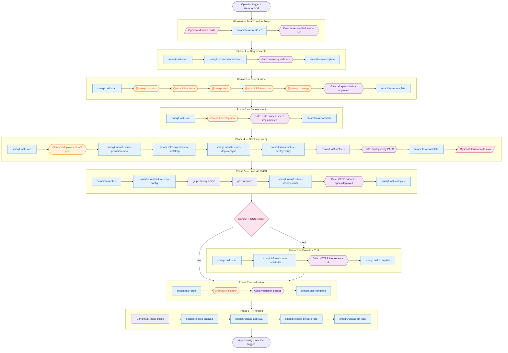
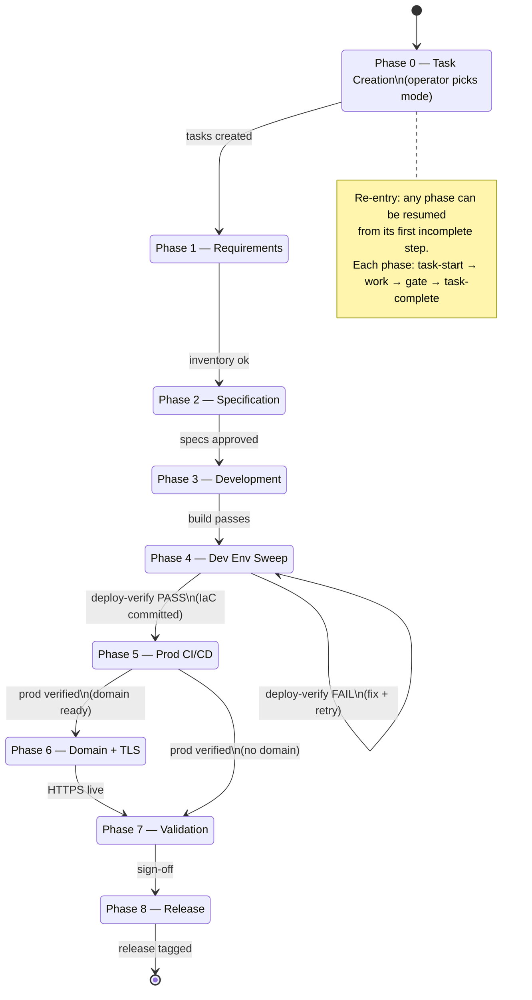
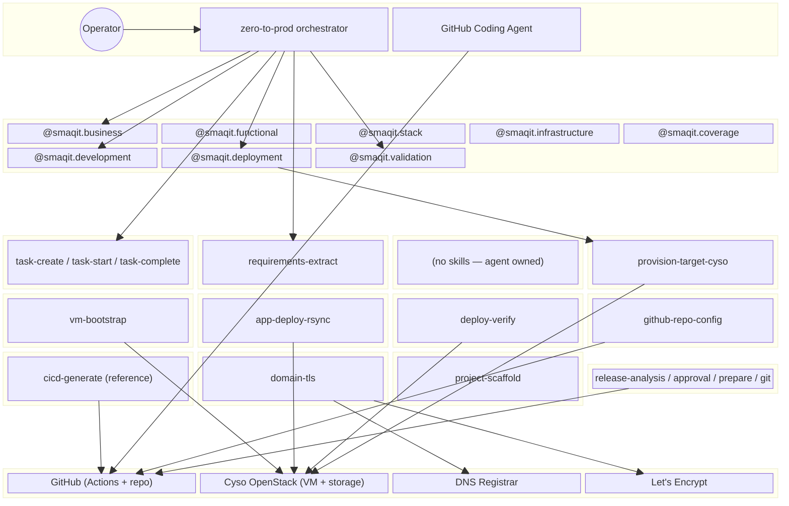

# Zero-to-Prod Workflow — Diagrams

Five complementary views of the `smaqit.new-greenfield-project` orchestrator workflow. Each diagram captures a different aspect of the journey.

---

## 1. Flowchart — The Journey

Best view of the **end-to-end path**: gates, conditional branches (Phase 6), the optional teardown step, and which steps are skills vs agents. Subgraphs group steps by phase.

Legend: blue = skill, orange = agent, purple = gate, pink = human/conditional.

---

## 2. Sequence Diagram — Who Calls What, In Order

Best view of the **invocation order** between operator, orchestrator, agents, skills, and external systems (GitHub Actions, Cyso VM). Makes the "agent invokes its own input skill internally" pattern explicit.

```mermaid
sequenceDiagram
    autonumber
    actor Op as Operator
    participant Orch as zero-to-prod Orchestrator
    participant TC as smaqit.task-* skills
    participant RE as smaqit.requirements-extract
    participant SA as Spec Agents (5)
    participant Dev as @smaqit.development
    participant Dep as @smaqit.deployment
    participant Prov as smaqit.infrastructure-provision-cyso
    participant Boot as smaqit.infrastructure-vm-bootstrap
    participant Rsync as smaqit.infrastructure-deploy-rsync
    participant Ver as smaqit.infrastructure-deploy-verify
    participant GH as smaqit.infrastructure-repo-config
    participant TLS as smaqit.infrastructure-domain-tls
    participant Val as @smaqit.validation
    participant Rel as smaqit.release-*
    participant CI as GitHub Actions
    participant VM as Cyso VM

    Op->>Orch: trigger /zero.to.prod (mode: assisted/autonomous)

    rect rgb(20,40,70)
    note over Orch,TC: Phase 0 — Task Creation
    Orch->>TC: task-create x7 (one per phase)
    end

    rect rgb(70,40,20)
    note over Orch,RE: Phase 1 — Requirements
    Orch->>TC: task-start (P1)
    Orch->>RE: extract requirements
    RE-->>Orch: inventory + ambiguities
    Orch->>Op: review ambiguities
    Op-->>Orch: resolutions
    Orch->>TC: task-complete (P1)
    end

    rect rgb(20,60,30)
    note over Orch,SA: Phase 2 — Specification
    Orch->>TC: task-start (P2)
    loop business → functional → stack → infrastructure → coverage
        Orch->>SA: invoke agent
        SA->>SA: invoke own input skill internally
        SA-->>Orch: spec written (status: draft)
    end
    Orch->>Op: approve spec set
    Orch->>TC: task-complete (P2)
    end

    rect rgb(60,20,60)
    note over Orch,Dev: Phase 3 — Development
    Orch->>TC: task-start (P3)
    Orch->>Dev: implement specs
    Dev-->>Orch: code + specs status: implemented
    Orch->>TC: task-complete (P3)
    end

    rect rgb(20,35,65)
    note over Orch,VM: Phase 4 — Dev Env Sweep
    Orch->>TC: task-start (P4)
    Orch->>Dep: generate IaC (state: dev/)
    Dep-->>Orch: terraform + workflow files
    Orch->>Prov: provision dev VM
    Prov->>VM: terraform apply
    Prov-->>Orch: fixed_ip
    Orch->>Boot: bootstrap VM
    Boot->>VM: install Docker + .env + /data mount
    Orch->>Rsync: deploy artifacts
    Rsync->>VM: rsync + docker compose
    Orch->>Ver: verify dev
    Ver->>VM: health + SHA + SPA checks
    Ver-->>Orch: PASS
    Orch->>Orch: commit IaC artifacts
    Orch->>TC: task-complete (P4)
    end

    rect rgb(65,45,20)
    note over Orch,CI: Phase 5 — Prod via CI/CD
    Orch->>TC: task-start (P5)
    Orch->>GH: set secrets + variables
    Orch->>CI: git push origin main
    CI->>VM: provision + deploy (prod state)
    CI-->>Orch: workflow run complete
    Orch->>Ver: verify prod
    Ver-->>Orch: PASS
    Orch->>TC: task-complete (P5)
    end

    rect rgb(45,20,65)
    note over Orch,VM: Phase 6 — Domain + TLS (conditional)
    alt domain + DNS ready
        Orch->>TC: task-start (P6)
        Orch->>TLS: configure domain + cert
        TLS->>VM: certbot + nginx reload
        TLS-->>Orch: HTTPS live
        Orch->>TC: task-complete (P6)
    else skipped
        Orch->>Orch: document open item
    end
    end

    rect rgb(20,55,55)
    note over Orch,Val: Phase 7 — Validation
    Orch->>TC: task-start (P7)
    Orch->>Val: run validation
    Val-->>Orch: checks pass
    Orch->>Op: sign-off
    Orch->>TC: task-complete (P7)
    end

    rect rgb(55,55,20)
    note over Orch,Rel: Phase 8 — Release
    Orch->>Orch: confirm all tasks closed
    Orch->>Rel: release-analysis → approval → prepare → git
    Rel-->>Orch: tagged release
    end

    Orch-->>Op: application running + release tagged
```

---

## 3. State Diagram — Phase Transitions + Re-entry

Best view of **re-entry semantics**: each phase is a state with a gate-controlled transition. Highlights the loop-back on `deploy-verify` failure and the Phase 6 skip branch.

---

## 4. Component / Block Diagram — Architecture View

Best view of **what connects to what across boundaries**: which skills touch which external systems (GitHub, Cyso, DNS, Let's Encrypt). No order — just structural composition.

---

## 5. Gantt Chart — Phase Sequencing

Best view of **relative phase length and dependencies**. Phase 6 is marked critical/optional. Phase 8 is a milestone. Durations are illustrative.

```mermaid
gantt
    title Zero-to-Prod Workflow — Phase Sequence
    dateFormat X
    axisFormat %s

    section Setup
    Phase 0 — Task Creation         :p0, 0, 1
    Phase 1 — Requirements          :p1, after p0, 2

    section Specs
    Phase 2 — Specification         :p2, after p1, 5

    section Build
    Phase 3 — Development           :p3, after p2, 8

    section Deploy
    Phase 4 — Dev Env Sweep         :p4, after p3, 4
    Phase 5 — Prod via CI/CD        :p5, after p4, 2
    Phase 6 — Domain + TLS (opt)    :crit, p6, after p5, 1

    section Verify + Ship
    Phase 7 — Validation            :p7, after p6, 2
    Phase 8 — Release               :milestone, p8, after p7, 0
```

---

## When to use which diagram

| Diagram | Best for |
|---|---|
| Flowchart | Onboarding new operators; explaining gates + branches |
| Sequence | Debugging "who invokes what"; agent vs skill distinction |
| State | Understanding re-entry and failure loop-back |
| Component | Auditing external system reach (security/compliance) |
| Gantt | Estimating duration; identifying long phases |
